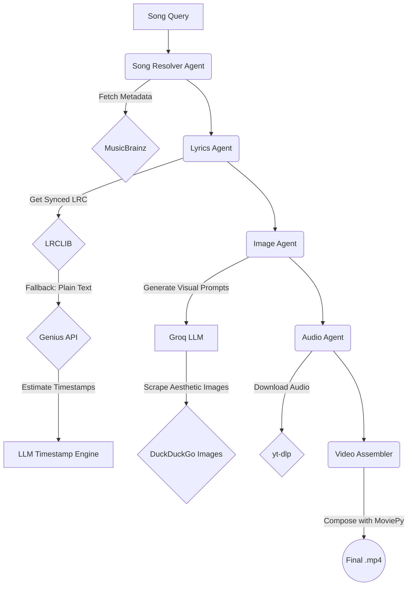

# YLine — Multi-Agent Lyric Video Pipeline

YLine is a fully autonomous LangGraph pipeline that leverages a multi-agent AI architecture to dynamically generate perfectly synced, aesthetic lyric videos from a simple song query.

## 🚀 How It Works

The pipeline is built on a conditional State Graph and uses Groq (LLMs) to reason through edge cases and orchestrate API tools.



### The Architecture
1. **Song Resolver**: Takes a vague query (e.g. "Color Your Night") and perfectly resolves it to its official artist, title, album, and release year via the MusicBrainz API.
2. **Lyrics Agent**: Fetches highly-accurate, human-verified synced `.lrc` files from LRCLIB. If the backend fails or returns unsynced text, it organically pivots to the Genius API, grabs the raw text, and streams it through a specialized LLM protocol to predict the timestamps mathematically.
3. **Image Agent**: Reads the literal text of each lyric line and generates a highly specific, stylistic search query. It then synchronously scrapes DuckDuckGo for high-quality images that match the emotional tone of the lyric.
4. **Audio Agent**: Wraps `yt-dlp` to securely fetch the highest-quality official audio stream for the resolved metadata.
5. **Video Assembler**: Uses MoviePy to sequentially map the extracted images and text blocks directly onto the audio timeline, rendering a 1080p hardware-accelerated `.mp4`.

## 💻 Interactive Showcase

To view the generated artifacts, launch the included static frontend server:

```bash
uv run python -m RangeHTTPServer 8000
```
Then visit `http://localhost:8000` to interact with the pipeline logs, raw JSON metadata, and final video outputs for 5 test tracks.

## 🛠 Setup

Ensure you have [uv](https://github.com/astral-sh/uv) installed, then run:

```bash
# Sync dependencies
uv sync

# Set your API keys in .env
cp .env.example .env

# Run the pipeline
uv run yline "Song Name by Artist"
```
