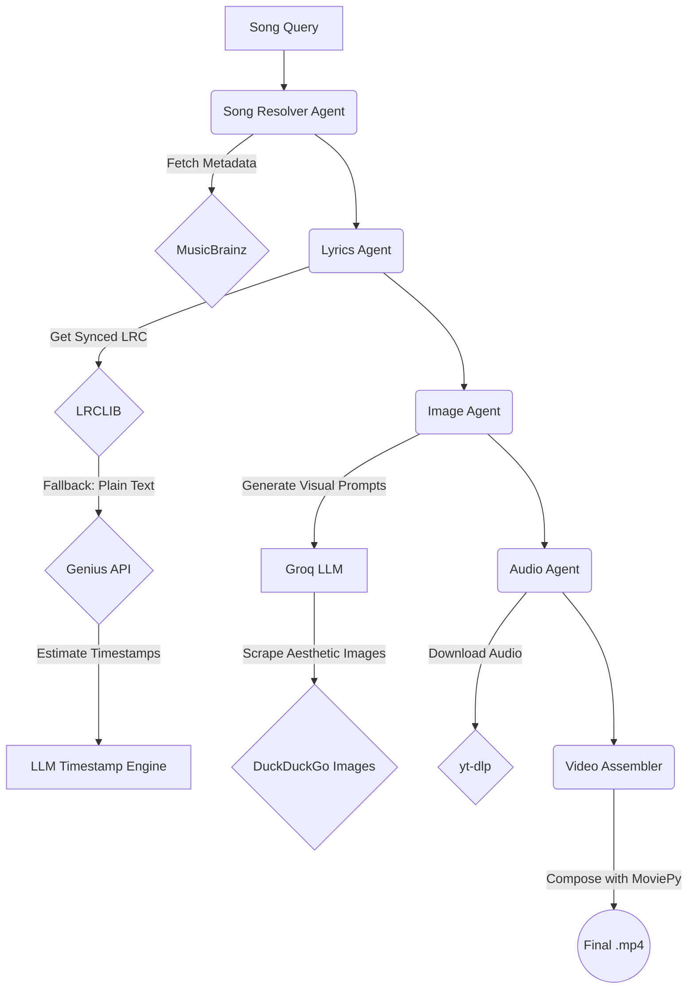

# YLine — Multi-Agent Lyric Video Pipeline

[](https://pjpangilinan.github.io/yline/)
[](https://www.python.org/)
[](https://langchain-ai.github.io/langgraph/)
[](https://github.com/astral-sh/uv)

**YLine** is a fully autonomous LangGraph pipeline that coordinates specialized AI agents to dynamically generate perfectly synchronized, aesthetic lyric videos from a simple song query.

---

## 🌐 Live Showcase

Experience the interactive scrollytelling showcase running on GitHub Pages:

👉 **[https://pjpangilinan.github.io/yline/](https://pjpangilinan.github.io/yline/)**

Explore every stage of the multi-agent pipeline (Metadata Resolution, Lyric Syncing, Mood-Matched Image Scraping, and Video Assembly) across 5 full tracks:
- **Lotus Juice** — *Color Your Night*
- **Panic! at the Disco** — *London Beckoned Songs About Money Written by Machines*
- **Will Joseph Cook** — *Take Me Dancing*
- **The Long Faces** — *Jane!*
- **fitterkarma** — *Kalapastangan*

---

## 🚀 How It Works

The pipeline is built on a conditional State Graph and uses Groq LLMs to orchestrate APIs, reason through edge cases, and handle fallbacks.



### The Architecture
1. **Song Resolver**: Takes a loose user query (e.g. *"Color Your Night"*) and resolves official artist, title, album, and release year via the MusicBrainz API.
2. **Lyrics Agent**: Fetches highly accurate, human-verified synced `.lrc` files from LRCLIB with instrumental gap capping. If unavailable, it pivots to the Genius API and utilizes an LLM protocol to predict timestamps mathematically.
3. **Image Agent**: Reads each lyric line to craft evocative, stylistic prompts, query DuckDuckGo Images, and enforce perceptual hash deduplication to guarantee unique, mood-appropriate imagery.
4. **Audio Agent**: Leverages `yt-dlp` to securely fetch the highest-quality official audio stream for the resolved metadata.
5. **Video Assembler**: Uses MoviePy to composite visual slides, synchronized ASS typography, and audio into 1080p hardware-accelerated `.mp4` video.

---

## 💻 Local Showcase Server

To view the showcase locally:

```bash
# Serve the docs directory
uv run python -m http.server 8080 -d docs
```
Then visit `http://localhost:8080` in your browser.

---

## 🛠 Setup & CLI Usage

Ensure you have [uv](https://github.com/astral-sh/uv) installed, then:

```bash
# 1. Sync dependencies
uv sync

# 2. Configure environment variables
cp .env.example .env

# 3. Run the CLI pipeline
uv run yline "Song Name by Artist"
```

### Running Tests

```bash
uv run python -m unittest discover tests
```

---

## 📄 License

MIT
